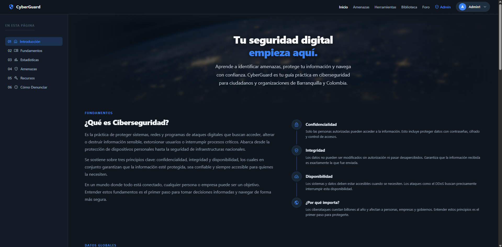
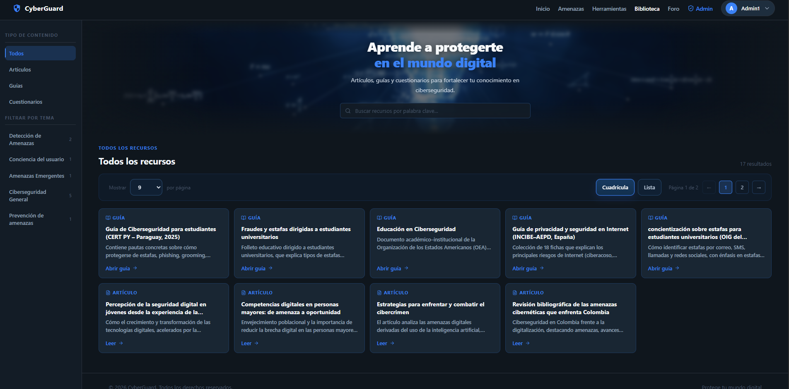
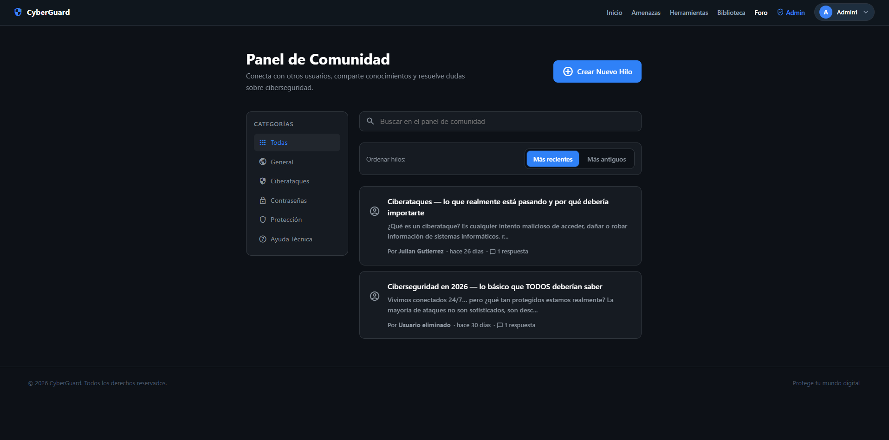
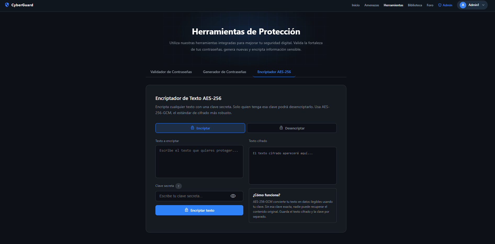

# CyberGuard - Frontend

## Descripción del Proyecto

CyberGuard es una plataforma web interactiva orientada a la prevención de estafas digitales y al fortalecimiento de la alfabetización en ciberseguridad ciudadana.

El sistema busca educar a usuarios sobre amenazas digitales comunes, facilitar el acceso a recursos educativos y proporcionar herramientas prácticas para mejorar la seguridad digital, especialmente en poblaciones con bajos niveles de alfabetización tecnológica.

El frontend de CyberGuard ofrece una experiencia interactiva y accesible mediante una interfaz moderna, intuitiva y responsive desarrollada con React y TypeScript.

---

## Características principales

* Autenticación de usuarios
* Gestión de sesiones
* Biblioteca educativa sobre ciberseguridad
* Foro comunitario de reportes y discusión
* Herramientas de protección:

  * Validador de contraseñas
  * Generador de contraseñas seguras
  * Encriptador AES-256
* Diseño responsive
* Navegación protegida por roles
* Integración con API REST

---

## Tecnologías usadas

* React
* TypeScript
* CSS
* Axios
* React Router DOM
* JWT Authentication
* Vercel (despliegue frontend)
* Git & GitHub

---

## Arquitectura

CyberGuard implementa una arquitectura **Cliente-Servidor (Client-Server)** desacoplada.

El frontend consume servicios REST expuestos por el backend mediante autenticación basada en JWT.

### Arquitectura general

```text
Usuario
   │
   ▼
Frontend (React + TypeScript)
   │
   ▼
API REST (Django + DRF)
   │
   ▼
Base de datos PostgreSQL (Neon)
```

### Organización general

```text
src/
│── assets/
│── components/
│── constants/
│── context/
│── pages/
│── routes/
│── styles/
│── types/
│── utils/
```

---

## Instalación de manera local

### 1. Clonar el repositorio

```bash
git clone <URL_DEL_REPOSITORIO>
```

### 2. Entrar al proyecto

```bash
cd cyberguard-frontend
```

### 3. Instalar dependencias

```bash
npm install
```

### 4. Configurar variables de entorno

Crear un archivo `.env`:

```env
VITE_API_URL=http://localhost:8000/api
```

### 5. Ejecutar el proyecto

```bash
npm run dev
```

El sistema quedará disponible en:

```txt
http://localhost:5173
```

---

## Variables de entorno

Ejemplo de archivo `.env`:

```env
VITE_API_URL=http://localhost:8000/api
```

---

## Capturas del sistema

### Página principal

Pantalla principal con fundamentos de ciberseguridad y contenido introductorio.



### Biblioteca educativa

Repositorio de artículos, guías y contenido educativo para fortalecer conocimientos de ciberseguridad.



### Foro comunitario

Espacio de discusión y reporte de amenazas digitales entre usuarios.



### Herramientas de protección

Módulo interactivo que integra herramientas de seguridad digital.

Incluye:

* Validador de contraseñas
* Generador de contraseñas
* Encriptador AES-256



---

## Despliegue

El frontend se encuentra preparado para despliegue en:

* Vercel

Proceso recomendado:

```bash
npm run build
```

Luego conectar el repositorio a Vercel.

---

## Licencia

### Uso Académico

Este proyecto fue desarrollado con fines académicos como trabajo de grado.

Su uso, modificación y distribución debe respetar el contexto educativo y citar a sus autores.

---

## Autores

* Ashley Jayreth Villa Montejo
* Daniel José Pino El Sahli
* Julián Alexander Gutierrez Mercado

Proyecto desarrollado para la Universidad Nacional Abierta y a Distancia (UNAD).
